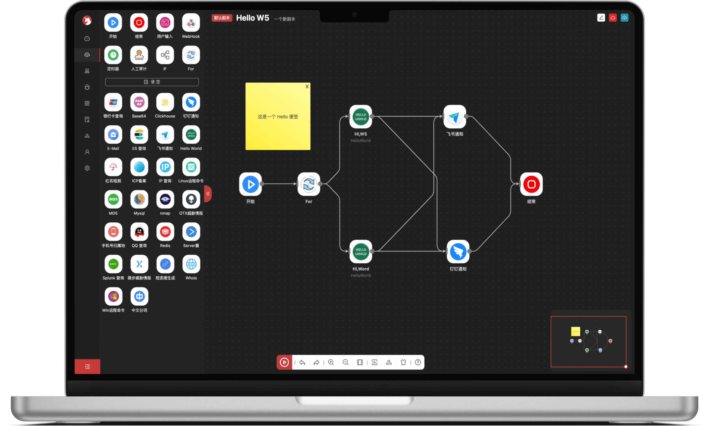
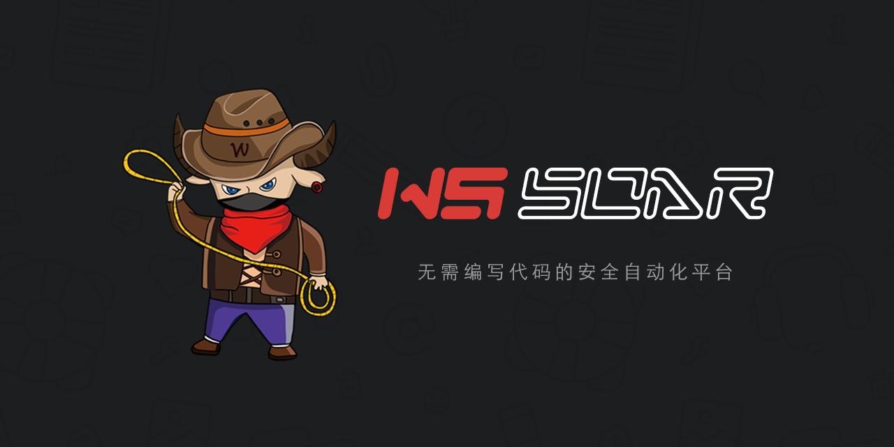
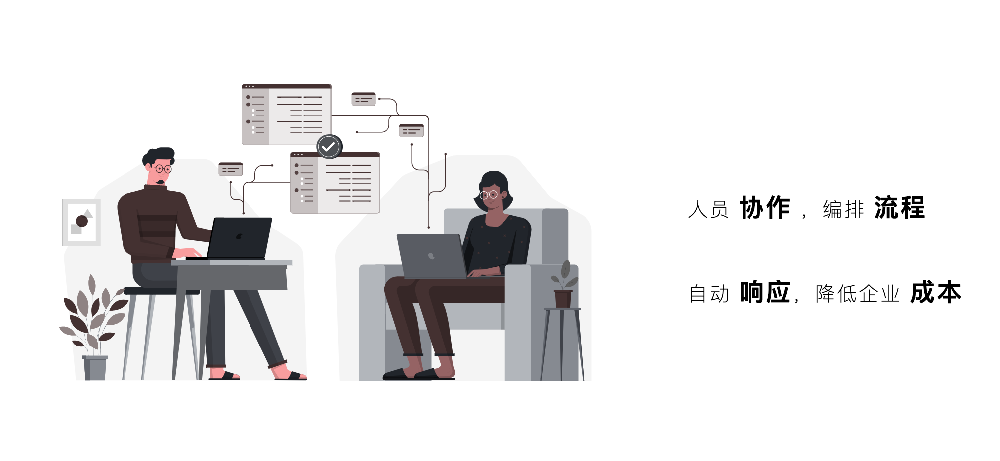
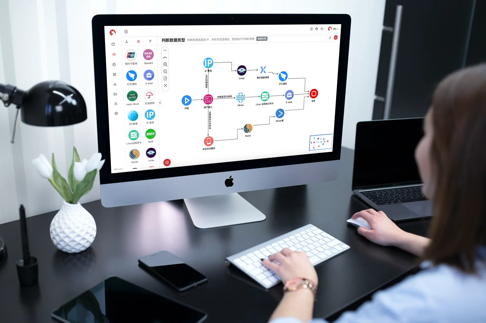
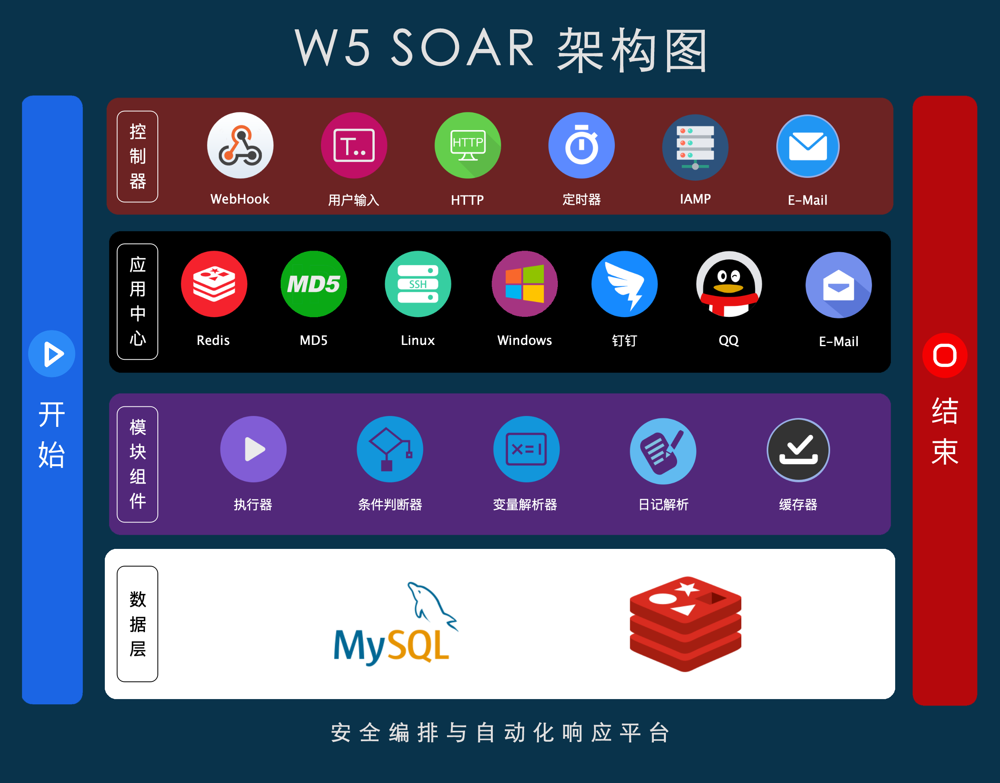
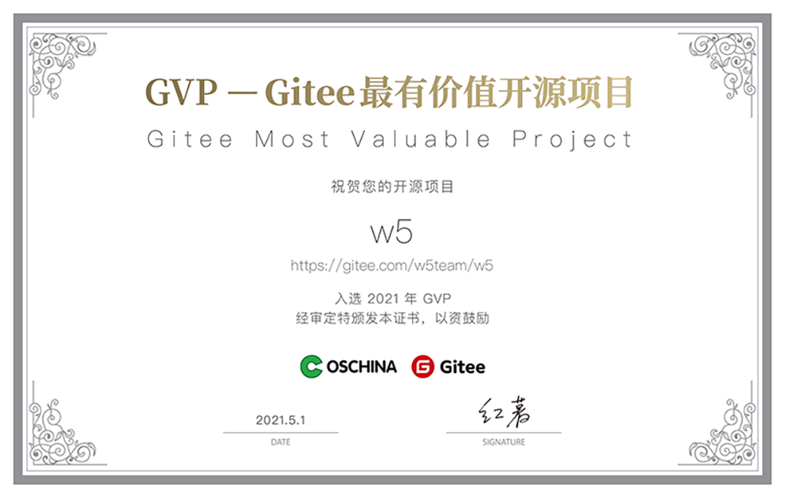

> 免责声明：
> - 禁止用于非法用途，一切违法行为与作者无关。
> - 所有插件的使用均符合国家相关法律法规，网络安全法等，我方遵守开源协议及 APP 厂商的相关要求。
> - 本项目采用 GPL v3 开源协议，企业二次开发需进行开源公布，发现违法开源协议者，将采用法律追究。

## W5 介绍

**W5** 是一个面向企业安全与运维设计的 **低代码** 自动化平台，可以让团队降低 **人工成本**，提升 **工作效率**。可以把代码 **图形化**、**可视化**、**可编排**。让不同的系统，不同的组件通过 APP 进行封装形成平台能力，通过剧本画出你想要的逻辑过程，利用多种 **Trigger** 去实现自动化执行。W5 适应用于多个方向，例：Devops、安全运营、自动化渗透、工作流程等

 
## 为什么要使用它？

- 节约企业成本
- 提升工作效率
- 增加团队协作能力
- 代码可视化配置编排
- 无需担心开发人员离职后的交接问题
- 不懂代码的小白一样也可以实现自动化

## 部分界面

1、两种主题，漂亮的 UI

2、简单上手的工作流编辑器

## 架构图

## GVP 证书

> W5 项目获得 2021年 最有价值的开源项目

## 如何使用

- **官网**：https://w5.io
- **文档**：https://w5.io/help/  (文档有完整的教程)
- **Github**: https://github.com/w5teams/w5 (感觉项目好的请来个 Star)

## 深入交流

**如对此产品想深入了解** 或 **部署遇到问题的请加我微信进用户反馈群**

请备注：**`W5`**, **`SOAR`** 方便实时进群

